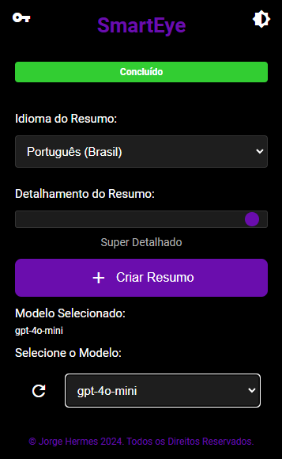

# SmartEye


**SmartEye** é uma extensão de navegador que resume o conteúdo da página atual usando inteligência artificial e oferece a funcionalidade de leitura em voz alta. Com uma interface intuitiva e personalizável, o SmartEye facilita a absorção rápida de informações essenciais de qualquer página web.

## 🛠️ Características

- **Resumo Inteligente:** Utiliza a API da OpenAI para gerar resumos concisos do conteúdo da página atual.
- **Leitura em Voz Alta:** Convoca a síntese de voz para ouvir o resumo gerado.
- **Temas Personalizáveis:** Alterna entre modos claro e escuro conforme a preferência do usuário.
- **Gerenciamento de Resumos:** Salva e gerencia resumos para acesso futuro.
- **Seleção de Modelos:** Escolha entre diferentes modelos da OpenAI para personalizar a geração de resumos.
- **Configurações de Voz:** Ajuste a velocidade e o volume da síntese de voz.

## 📸 Capturas de Tela



## ⚙️ Instalação

1. **Clone o Repositório:**

   ```bash
   git clone https://github.com/jhermesn/SmartEye.git
   ```

2. **Acesse a Página de Extensões do Navegador:**

   - No Chrome: `chrome://extensions/`
   - No Firefox: `about:debugging#/runtime/this-firefox`

3. **Ative o Modo de Desenvolvedor:**

   - No Chrome, ative o "Modo de desenvolvedor" no canto superior direito.

4. **Carregue a Extensão Não Empacotada:**

   - Clique em "Carregar sem compactação" e selecione a pasta do projeto `SmartEye`.

## 🛠️ Configuração

1. **Obtenha uma Chave da API da OpenAI:**

   - Visite [OpenAI](https://openai.com/) e crie uma conta ou faça login.
   - Navegue até a seção de API e gere uma nova chave.

2. **Insira a Chave da API:**

   - Abra a extensão SmartEye no navegador.
   - Insira sua chave da OpenAI no campo designado e clique em "Salvar Chave".

## 📖 Uso

1. **Resumir uma Página:**

   - Clique no ícone da extensão SmartEye.
   - Se for a primeira vez, insira sua chave da OpenAI.
   - Selecione o idioma e o nível de detalhamento desejado.
   - Clique em "Criar Resumo" para gerar um resumo do conteúdo atual da página.

2. **Ouvir o Resumo:**

   - Após a criação do resumo, clique em "Falar" para ouvir o resumo gerado.
   - Ajuste a velocidade e o volume conforme necessário.

3. **Gerenciar Resumos:**

   - Utilize os botões "Abrir Resumo Existente" para acessar resumos previamente salvos.

4. **Alterar Tema:**

   - Use o botão de alternância de tema no canto superior direito para alternar entre os modos claro e escuro.

## 🤝 Contribuição

Contribuições são bem-vindas! Siga estes passos para contribuir:

1. **Fork este repositório.**

2. **Crie uma branch para sua feature:**

   ```bash
   git checkout -b feature/nova-feature
   ```

3. **Commit suas mudanças:**

   ```bash
   git commit -m "Adiciona nova feature"
   ```

4. **Push para a branch:**

   ```bash
   git push origin feature/nova-feature
   ```

5. **Abra um Pull Request.**

## 📜 Licença

Este projeto está licenciado sob a Licença Creative Commons Attribution-ShareAlike 4.0 International (CC BY-SA 4.0). Veja o arquivo [LICENSE](LICENSE) para mais detalhes.

## 📫 Contato

Para quaisquer dúvidas ou sugestões, sinta-se à vontade para entrar em contato:

- **E-mail:** [jhermesn@jorgehermes.me](mailto:jhermesn@jorgehermes.me)
- **Website:** [https://jorgehermes.me](https://jorgehermes.me)
- **LinkedIn:** [https://linkedin.com/in/jhermesn](https://linkedin.com/in/jhermesn)
